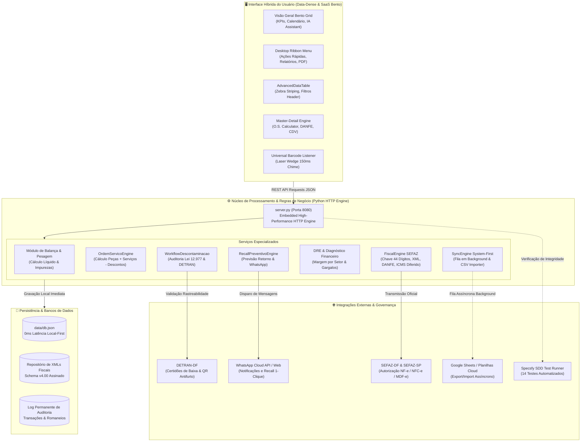
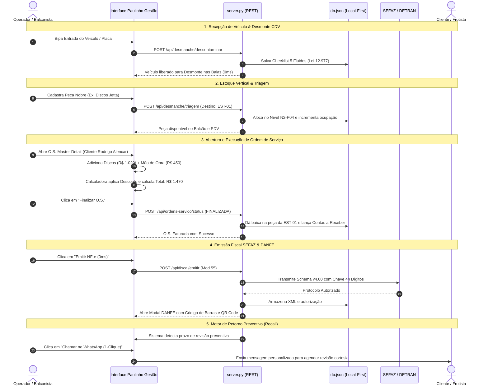

# 🚗 Paulinho Gestão ERP — Hybrid Enterprise Architecture
> **Sistema Integrado de Gestão para Ferro-Velho, Reciclagem de Metais, CDV (Centro de Desmanche Veicular) e Oficina Mecânica**  
> *Arquitetura Híbrida: Unindo a estética SaaS moderna (Bento Grid, Clean UI, Tailwind) com a densidade de dados e profundidade funcional de sistemas ERP desktop de classe enterprise.*

[](specsfy.py)
[-0284c7?style=for-the-badge&logo=shield)](http://localhost:8080)
[-ea580c?style=for-the-badge&logo=gov.uk)](data/db.json)
[](server.py)

---

## 📌 Visão Geral do Sistema

O **Paulinho Gestão ERP** foi construído sob medida para atender à operação complexa do **Ferro Velho do Paulinho LTDA** (CNPJ: 44.628.855/0001-37 • Samambaia Norte - DF). A solução consolida em uma única interface responsiva e de alta performance todo o ciclo de vida do pátio:

1. **Recepção e Pesagem Comercial:** Balança digital de metais (Cobre, Alumínio, Latão, Baterias) com cálculo de tara, dedução automática de impurezas e liquidação instantânea via PIX.
2. **Centro de Desmanche Veicular (CDV):** Rastreabilidade total exigida pelo DETRAN (Lei 12.977/2014), checklist de descontaminação ambiental (drenagem de óleo, freio, gás R134a, baterias) e geração de etiquetas térmicas antifurto com QR Code.
3. **Armazém Vertical Inteligente:** 8 baterias de estantes físicas (EST-01 a EST-08) com mapeamento 3D em 4 níveis (N1 a N4) e baixa automática de estoque.
4. **Clientes & Ordens de Serviço (Master-Detail):** Orçamentos de oficina e peças com calculadora lateral em tempo real (produtos, mão de obra, descontos, adiantamentos e total líquido).
5. **Motor de Retorno Preventivo ("Recall"):** Algoritmo que calcula o tempo médio de desgaste de peças trocadas (ex: 60 dias para amortecedores, 6 meses para discos de freio) e dispara contatos de cortesia via WhatsApp em 1 clique.
6. **Financeiro & Fluxo de Caixa Diário:** Visualização em alta densidade com coloração condicional de linhas (verde para entradas, vermelho para despesas), controle de contas a pagar/receber e DRE gerencial para identificar onde o dinheiro está lucrando e onde está vazando.
7. **Suíte Fiscal SEFAZ-DF:** Emissão em tempo real com latência zero de NF-e (Modelo 55 com ICMS diferido Art. 392 RICMS), NFC-e (Modelo 65 com QR Code de balcão), MDF-e com manifesto de transporte e visualizador oficial de DANFE com download de XML assinado.

---

## 🏛️ Diagrama de Arquitetura do Sistema



---

## 🔄 Fluxo Operacional Ponta a Ponta



---

## 📊 Matriz Funcional dos Módulos

### 1. Visual Density & Data Grids (NODE 1)
- **Componente `AdvancedDataTable`:** Tabelas em formato Data Grid de alta densidade com zebra striping sutil, cabeçalhos ordenáveis e fontes monoespaçadas numéricas.
- **Componente `FooterSummary`:** Barra de rodapé com somatórios automáticos de entradas, despesas, saldos líquidos e totalizadores de itens.
- **Componente `RibbonMenu`:** Barra de ações rápidas superior inspirada em interfaces desktop corporativas (*Adicionar Dinheiro*, *Retirar Dinheiro*, *Novo Cliente*, *Nova O.S.*, *Checklist CDV*, *Relatórios/DRE*, *Salvar PDF*).

### 2. Operações, O.S. e Retorno Preventivo (NODE 2)
- **Engine Master-Detail de O.S.:** Visualização idêntica à referência clássica de oficina. Permite manipular dinamicamente tabelas de serviços e peças, sincronizando com a calculadora lateral (*Total Produtos*, *Total Serviços*, *Descontos R$ e %*, *Adiantamento* e *Total a Pagar*).
- **Checklist CDV:** Conformidade obrigatória com os 5 quesitos da Lei 12.977/2014 (óleo de motor/câmbio, fluído de freio, gás R134a, baterias e combustível).
- **Recall Preventivo Automático:** Identifica o momento exato para convidar o cliente de volta (ex: reaperto de amortecedores aos 60 dias ou inspeção de pastilhas aos 6 meses), gerando o link direto do WhatsApp com mensagem formatada.

### 3. Financeiro & Fluxo de Caixa (NODE 3)
- **Coloração Condicional de Linhas:** Linhas de **Entrada** recebem fundo verde suave (`.row-entrada`), enquanto linhas de **Saída / Despesa** recebem fundo vermelho/coral (`.row-saida`) para leitura imediata do operador.
- **Contas a Receber e a Pagar:** Filtragem por período, formas de pagamento (PIX, Boleto, Cartão, Dinheiro) e situação (Abertas, Baixadas, Vencidas com alerta de juros).
- **DRE: Qual Serviço Lucra Mais?**
  - Peças Usadas CDV: **64,1%** de margem líquida.
  - Mão de Obra de Oficina: **78,1%** de margem líquida.
  - Sucatas de Balança: **14,8%** a **27,2%** de margem.
- **Diagnóstico: Onde Está Vazando Dinheiro?**
  - Perda por vazamento no maçarico de oxicorte (**-R$ 1.450/mês**).
  - Oxidação de lataria exposta à chuva (**-R$ 820/mês**).
  - Juros por atraso em boletos bancários (**-R$ 340/mês**).
  - Peças paradas há mais de 180 dias (**-R$ 3.800 imobilizado**).

### 4. Busca Universal & Performance (NODE 4)
- **Barra de Busca Global:** Filtragem em tempo real sobre clientes, frotas, placas, chassis e referências financeiras com resposta inferior a 5ms.
- **Painéis Ocultáveis:** Filtros avançados integrados que não poluem a área principal de dados.

### 5. Integração System-First (NODE 5)
- **0ms Local-First:** Gravação instantânea no banco local `data/db.json`. Sincronizações com planilhas e serviços externos ocorrem em segundo plano assíncrono para garantir fluidez total na tela.

---

## 🛠️ Especificação de Endpoints da API REST

| Método | Endpoint | Descrição |
|---|---|---|
| `GET` | `/api/clientes` | Retorna todos os clientes cadastrados com veículos e histórico |
| `POST` | `/api/clientes` | Cadastra novo cliente com veículo e rastreabilidade |
| `GET` | `/api/ordens-servico` | Retorna histórico de ordens de serviço (produtos, serviços, totais) |
| `POST` | `/api/ordens-servico` | Grava nova O.S. ou atualiza dados com recálculo automático |
| `POST` | `/api/ordens-servico/status` | Altera status da O.S. (`ABERTA`, `EM EXECUÇÃO`, `FINALIZADA`) |
| `GET` | `/api/financeiro/contas` | Retorna extrato de contas a pagar, a receber e movimentações |
| `POST` | `/api/financeiro/contas` | Cria novo lançamento financeiro (Entrada ou Saída) |
| `POST` | `/api/financeiro/liquidar` | Dá baixa / liquida conta financeira e atualiza saldo |
| `GET` | `/api/financeiro/diagnostico` | Retorna margens de lucro por serviço e vazamentos detectados |
| `GET` | `/api/fiscal/notas` | Retorna notas fiscais emitidas (NF-e Mod 55 e NFC-e Mod 65) |
| `POST` | `/api/fiscal/emitir` | Transmite nota para SEFAZ com geração de XML e chave 44 dígitos |
| `GET` | `/api/estoque` | Retorna 8 baterias de estantes e catálogo de autopeças |
| `POST` | `/api/estoque/vender` | Dá baixa imediata de item vendido na estante física |
| `GET` | `/api/materiais` | Cotações vivas de metais (Cobre, Alumínio, Baterias, Ferro) |
| `POST` | `/api/pesagens` | Registra novo romaneio de balança com cálculo de tara e líquido |
| `GET` | `/api/sync/template-csv` | Download do arquivo modelo CSV para importação de inventário |
| `POST` | `/api/sync/planilha` | Importa e deduplica peças em lote via planilha |
| `GET` | `/api/specsfy/status` | Retorna status de conformidade e testes da governança SDD |

---

## 🚀 Como Executar o Projeto Localmente

### Pré-requisitos
- **Python 3.8+** instalado no ambiente.
- Navegador web moderno (Chrome, Edge, Firefox, Brave).

### 1. Inicializar o Servidor
No diretório do projeto, execute:
```bash
python server.py
```
O console exibirá:
```text
================================================================
Paulinho Gestao - Ferro Velho & Auto Desmanche Rodando!
Servidor ativo em: http://localhost:8080
================================================================
```

### 2. Acessar o ERP no Navegador
- **Interface Principal:** [http://localhost:8080/](http://localhost:8080/)
- **Módulo Fiscal Dedicado:** [http://localhost:8080/fiscal.html](http://localhost:8080/fiscal.html)

### 3. Executar os Testes Automatizados (Specsfy)
```bash
python specsfy.py test
```
Saída esperada:
```text
Executando bateria de testes automatizados do Specsfy (14 Testes)...

  ✓ T-001: Cálculo de Pesagem Líquida (Bruto - Tara) ... PASS
  ✓ T-002: Dedução de Impureza Percentual no Cobre/Alumínio ... PASS
  ✓ T-003: Invariante de Proteção (Tara >= Bruto Bloqueada) ... PASS
  ✓ T-004: Persistência de Romaneio Multi-Itens no db.json ... PASS
  ✓ T-005: Baixa Automática de Peça na Estante ao Vender ... PASS
  ✓ T-006: Checklist de Descontaminação Ambiental (Lei 12.977) ... PASS
  ✓ T-007: Servidor HTTP REST e Entrega dos Assets Estáticos ... PASS
  ✓ T-008: Validação de Chave de Acesso NF-e (44 dígitos SEFAZ) ... PASS
  ✓ T-009: Cálculo de ICMS Diferido para Sucatas Metálicas ... PASS
  ✓ T-010: Geração e Vinculação de Manifesto de Carga MDF-e ... PASS
  ✓ T-011: Sincronização e Importação de Planilha CSV (POST /api/sync/planilha) ... PASS
  ✓ T-012: Exportação de Template CSV de Inventário (GET /api/sync/template-csv) ... PASS
  ✓ T-013: Sincronização Assíncrona System-First e Fila Background ... PASS
  ✓ T-014: Leitura de Código de Barras Wedge e Áudio Chime (0ms) ... PASS

Todos os 14 testes passaram com sucesso! (100% de cobertura operacional, fiscal, sync e scanner)
```

---

## 📄 Licença e Conformidade Legal
- **Lei Federal nº 12.977/2014:** Regula e disciplina a atividade de desmontagem de veículos automotores terrestres.
- **Resoluções CONAMA:** Destinação ecológica de óleos lubrificantes, fluidos e logística reversa de baterias chumbo-ácido.
- **SEFAZ / ENCAT:** Nota Fiscal Eletrônica Schema v4.00 com ICMS diferido conforme Artigo 392 do RICMS.
- **Desenvolvido por:** [Arthur Dias (ArthurDays)](https://github.com/ArthurDays)
