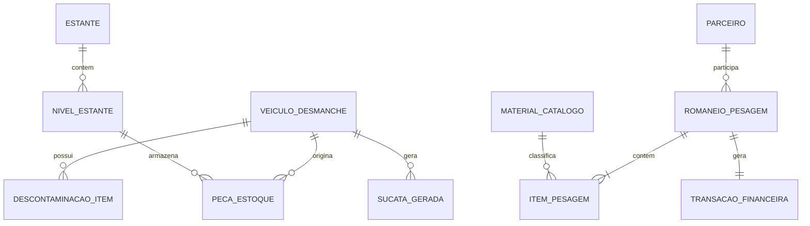

# Modelo de Dados & Entidades (Data Model)

**Padrão**: SpecKit Data Model Architecture  
**Sistema**: Sistema de Gestão para Ferro Velho e Auto Desmanche  
**Data**: 2026-09-27  

---

## 1. Diagrama de Relacionamento de Entidades (ERD)

---

## 2. Dicionário de Entidades

### 2.1. `MATERIAL_CATALOGO` (Classificação de Metais e Sucata)
| Campo | Tipo | Descrição | Regras |
| :--- | :--- | :--- | :--- |
| `id` | String | Código único (ex: `MT-COB-01`) | Primary Key |
| `nome` | String | Nome popular e comercial | Obrigatório (ex: "Cobre Mel Fio Limpo") |
| `categoria` | Enum | `Cobre`, `Aluminio`, `Ferro`, `Latao`, `Bateria`, `Inox`, `Especiais` | Classificação base |
| `preco_compra_kg` | Decimal | Preço pago ao catador/fornecedor (R$/kg) | > 0 |
| `preco_venda_kg` | Decimal | Preço cobrado na venda para fundição (R$/kg) | > preco_compra_kg |
| `tolerancia_impureza`| Decimal | Tolerância máxima aceitável de impureza (%) | Padrão 0% a 15% |
| `cor_identificador` | String | Cor hexadecimal de identificação visual na UI | Ex: `#e06d53` para Cobre |

### 2.2. `ROMANEIO_PESAGEM` (Ordem de Pesagem / Ticket de Balança)
| Campo | Tipo | Descrição | Regras |
| :--- | :--- | :--- | :--- |
| `id` | String | Código sequencial (ex: `ROM-2026-0042`) | Primary Key |
| `tipo` | Enum | `COMPRA` (Entrada/Pagar) ou `VENDA` (Saída/Receber) | Padrão `COMPRA` |
| `parceiro_id` | String | ID do Fornecedor ou Cliente | FK `PARCEIRO` |
| `data_hora` | DateTime | Timestamp ISO-8601 da pesagem | Data/hora atual |
| `operador` | String | Identificação do operador do balcão | Obrigatório |
| `status` | Enum | `Pendente`, `Pesado`, `Pago`, `Cancelado` | Máquina de estados |
| `peso_bruto_total` | Decimal | Somatório dos pesos brutos (kg) | $\ge$ peso_liquido_total |
| `tara_total` | Decimal | Somatório das taras (kg) | $\ge 0$ |
| `peso_liquido_total`| Decimal | Somatório dos pesos líquidos faturados (kg) | |
| `valor_total` | Decimal | Valor financeiro total da pesagem (R$) | $\sum \text{Subtotais}$ |
| `metodo_pagamento` | Enum | `PIX`, `DINHEIRO`, `TRANSFERENCIA`, `CARTAO`, `A_FATURAR` | |
| `observacoes` | String | Anotações adicionais do operador ou placa | |

### 2.3. `ITEM_PESAGEM` (Item Individual do Romaneio)
| Campo | Tipo | Descrição | Regras |
| :--- | :--- | :--- | :--- |
| `id` | String | Identificador do item | UUID |
| `romaneio_id` | String | Referência ao romaneio pai | FK `ROMANEIO_PESAGEM` |
| `material_id` | String | Referência ao material catalogado | FK `MATERIAL_CATALOGO` |
| `peso_bruto` | Decimal | Peso bruto aferido na balança (kg) | > 0 |
| `tara` | Decimal | Peso do recipiente / veículo (kg) | $\le$ peso_bruto |
| `peso_liquido_base` | Decimal | `peso_bruto - tara` | $\ge 0$ |
| `desconto_impureza_pct` | Decimal | Percentual descontado por impureza | 0% a 100% |
| `desconto_kg` | Decimal | Quilos líquidos descontados | |
| `peso_liquido_final` | Decimal | Peso faturado após deduções (kg) | |
| `preco_unitario_kg` | Decimal | Preço por kg aplicado | |
| `subtotal` | Decimal | `peso_liquido_final * preco_unitario_kg` | |

### 2.4. `PECA_ESTOQUE` (Autopeça Catalogada nas Prateleiras)
| Campo | Tipo | Descrição | Regras |
| :--- | :--- | :--- | :--- |
| `id` | String | Código da peça / QR Code (ex: `PC-2026-089`) | Primary Key |
| `descricao` | String | Nome da peça (ex: "Alternador 120A Bosch") | |
| `categoria` | Enum | `Mecanica`, `Eletrica`, `Freios`, `Suspensao`, `Lataria`, `Interior` | |
| `veiculo_origem_id` | String | Referência ao veículo de desmanche | FK `VEICULO_DESMANCHE` |
| `estante_id` | String | Código da estante física (`EST-01` a `EST-08`) | |
| `nivel` | Integer | Nível vertical (1: Bins, 2: Pesados, 3: Mecânica, 4: Topo) | 1 a 4 |
| `posicao_gaveta` | String | Endereço fino (ex: `G-04` ou `P-12`) | |
| `condicao` | Enum | `Grau A - Excelente`, `Grau B - Bom`, `Grau C - Recuperável` | |
| `preco_venda` | Decimal | Preço de venda no balcão (R$) | > 0 |
| `status` | Enum | `Disponivel`, `Reservado_Balcao`, `Vendido` | |

### 2.5. `VEICULO_DESMANCHE` (Veículo do Pátio de Desmanche)
| Campo | Tipo | Descrição | Regras |
| :--- | :--- | :--- | :--- |
| `id` | String | Identificador do lote (ex: `VD-2026-014`) | Primary Key |
| `marca_modelo` | String | Ex: "Jeep Compass Longitude 2.0 Flex" | |
| `ano` | Integer | Ano de fabricação (ex: 2021) | |
| `placa` | String | Placa Mercosul ou antiga | |
| `chassi` | String | Chassi de 17 caracteres | |
| `renavam` | String | Código Renavam | |
| `certidao_baixa_detran` | String | Número do protocolo de baixa oficial | Obrigatório por lei |
| `baia_atual` | Enum | `Baia 1 - Elevador A`, `Baia 2 - Elevador B`, `Patio de Entrada`, `Finalizado` | |
| `descontaminado` | Boolean | Se todos os fluidos obrigatórios foram removidos | True / False |
| `status` | Enum | `Aguardando_Descontaminacao`, `Em_Desmontagem`, `Desmontado_Prensado` | |
| `progresso_pct` | Integer | Percentual de peças aproveitadas/desmontadas | 0 a 100% |
